# LLVM IR Language Tools

Language support for LLVM IR (`.ll`, `.llvm`) in VS Code: hovers that explain values,
instructions and control flow; completion that knows what is valid where; checks as
you type, with no LLVM installation needed; cross-file navigation and rename; and a
control-flow graph of each function.

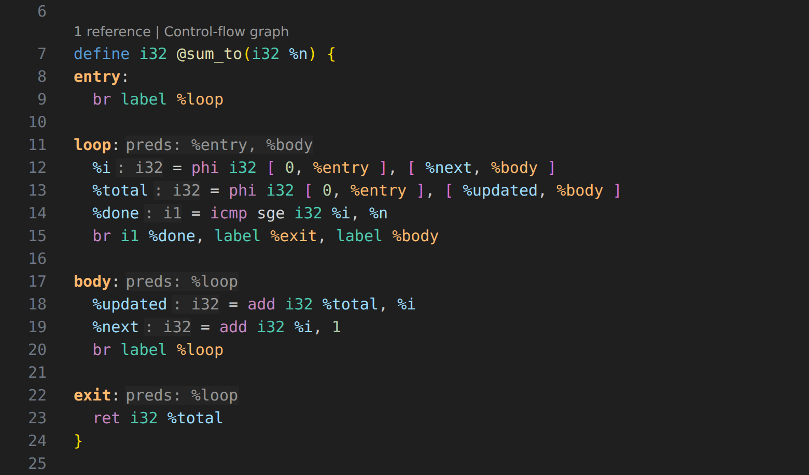

Extension ID: `cse4100-local.llvm-ir-highlighter`. Everything runs locally and offline.

**Contents:** [Install](#install) ·
[Understand IR](#understand-ir) · [Write IR](#write-ir) · [Catch mistakes](#catch-mistakes) ·
[Navigate and refactor](#navigate-and-refactor) · [See control flow](#see-control-flow) ·
[Settings](#settings) · [Reference](#reference) · [Develop and test](#develop-and-test)

## Install

1. Download the `.vsix` from the [latest release](https://github.com/MagicCat3022/llvm-ir-language-tools/releases/latest),
   under **Assets**. Or, with the [GitHub CLI](https://cli.github.com/):

   ```sh
   gh release download --repo MagicCat3022/llvm-ir-language-tools --pattern '*.vsix'
   ```

2. Install it: in VS Code, open the Extensions view, choose **… → Install from VSIX…**, and
   pick the file. Or, from a terminal in the download folder:

   ```sh
   code --install-extension llvm-ir-language-tools-*.vsix
   ```

3. Reload VS Code. To update later, install a newer `.vsix` the same way.

Disable `qiu.llvm-ir-language-support` and any original
`leoapagano.llvm-ir-highlighter` in this workspace, then reload. They register the
same language and can supply competing providers or grammars.

Merge this association into your existing workspace settings:

```json
{
  "files.associations": {
    "*.llvm": "llvm-ir"
  }
}
```

An existing association to `"llvm"` overrides recognition: `llvm` is an alias,
whereas `llvm-ir` is the registered language ID.

To try the features, open
[`samples/language-features.ll`](samples/language-features.ll) from this repository.
The original `samples/example.ll` remains a highlighting fixture, not a
compiler-validity test.

## Understand IR

**Hover anything** for a signature in the style of Python's Pylance: a `(kind) signature`
line, then documentation and context.

SSA values show their type, definition and location:

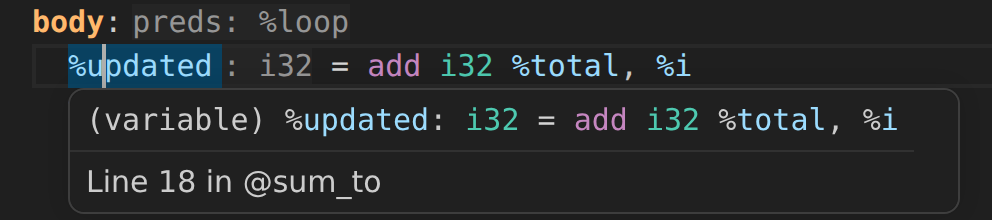

Instructions show their syntax, an explanation and a link to the LLVM Language
Reference. Comparisons list every predicate:

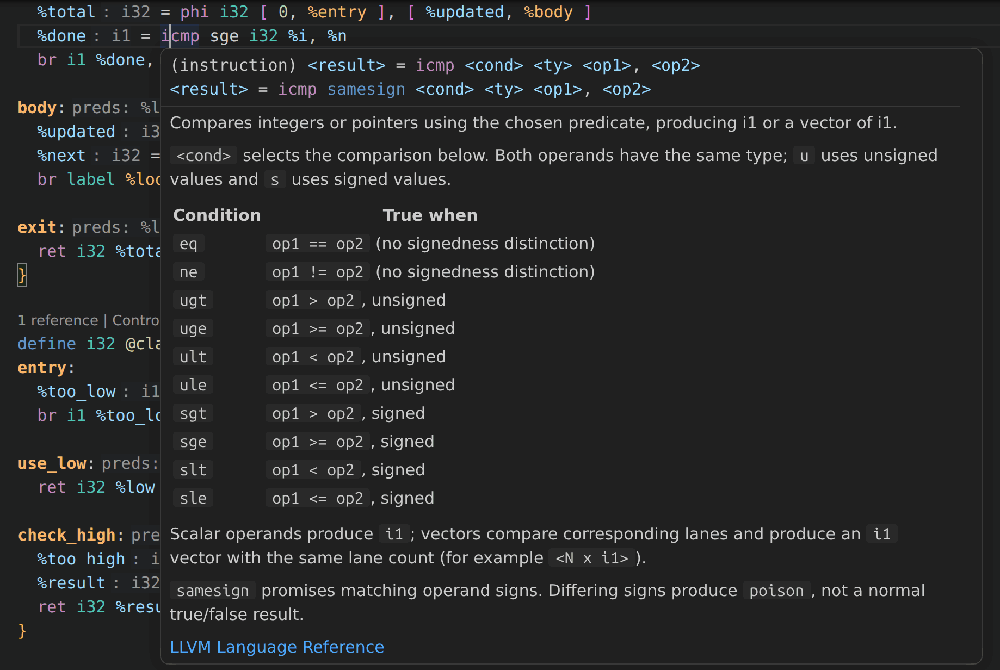

Branch targets describe the block's place in the control flow (predecessors, successors,
loop header, immediate dominator) and preview it:

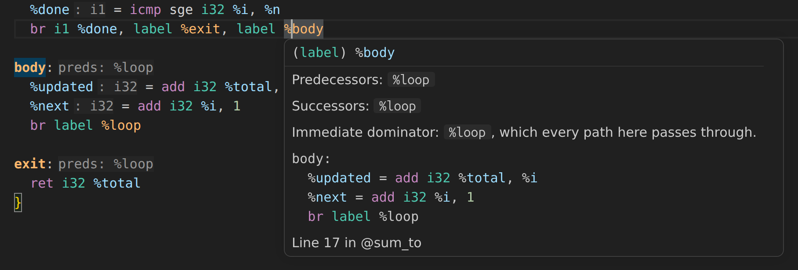

C library functions and LLVM intrinsics have offline documentation: parameters, return
value, notes, and for `printf` the format conversions (top of the hover shown):

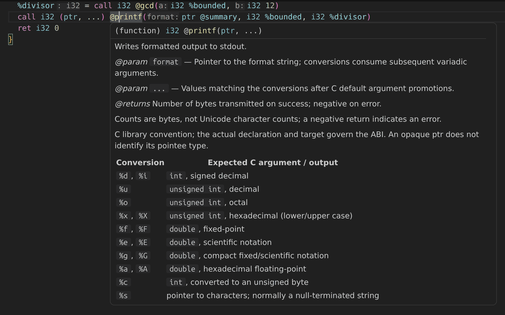

**Pointers say what they point to.** Opaque `ptr` values get a pointee when the file
determines it, with `?` marking an inference and the hover giving the reason, even
through a vtable:

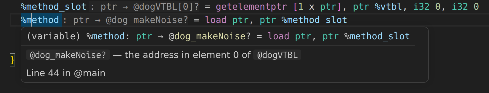

**Inlay hints** show the type of every SSA value (`: i32`), each block's predecessors
(`preds: %entry, %body`), and parameter names at call sites, including the documented
names of library functions such as `printf`:

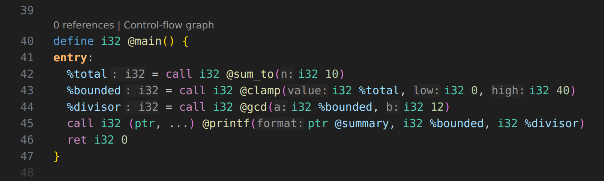

Also:

- Hovers on globals, named types, metadata and attribute groups show their definition;
  function hovers show one `(function)` signature with parameter names and attributes.
- Library help covers 20 C library functions (including `printf`) and 24 LLVM intrinsic
  families, with format guidance and parameter help. No network requests are made.
- Semantic coloring distinguishes functions, globals, local values, parameters, types and
  labels.

<details>
<summary>How pointer hints are inferred</summary>

Pointer hovers and inlay hints show what an opaque `ptr` refers to, as `ptr → pointee`. A trailing `?` marks a hint inferred from uses rather than stated by the instruction, and the hover adds one `pointee — reason` line for it:

- GEP results address a member: `%t1: ptr → i32`, with `` `i32` — field 1 of `%Class_Dog` ``.
- Stack slots show what they hold: `%a_ptr: ptr → ptr → %Class_Dog?`.
- Pointers take the type a GEP indexes them as, including through a direct call or a stack slot: `%a_obj: ptr → %Class_Dog?`.
- A load from an object field whose only stored value is a global's address points to that global (`%a_vtbl: ptr → @dogVTBL?`), and a load from a constant table resolves the entry (`%a.makeNoise_method: ptr → @dog_makeNoise?`), so indirect vtable calls name their likely target. `→ @g` means the pointer holds the address of `@g`; it never means the value is `@g`'s contents.
- The first `ptr` parameter of a function listed in such a table (a vtable method) shows its likely receivers: `%this: ptr → %Class_Animal | %Class_Dog?`.

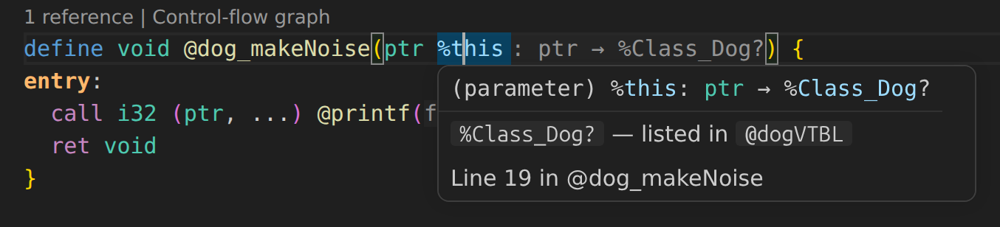

</details>

## Write IR

**Completion knows what fits.** Where an operand goes, it offers only values of the
expected type whose definition is available (dominates the use):

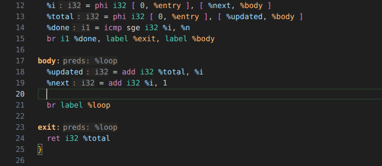

After `label` and in `phi` incoming slots it offers the function's blocks (never the
entry block); after `icmp`/`fcmp`, the predicates:

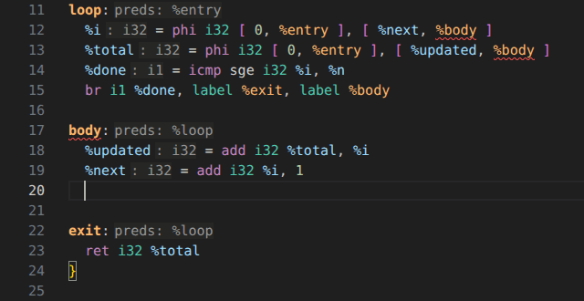

**Signature help** follows the argument you are typing:

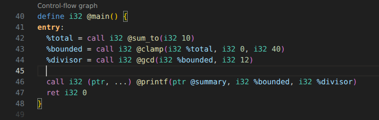

**Functions from other files** complete like an auto-import: choosing one adds the
matching `declare` line, copied from the definition:

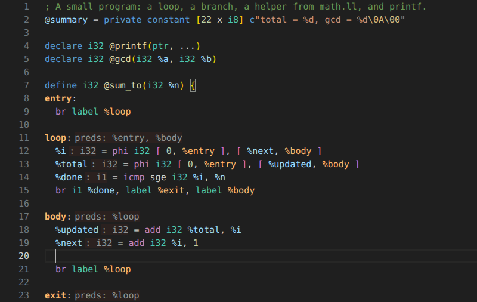

Formatting fixes indentation, and each function and basic block folds on its own,
keeping the label visible:

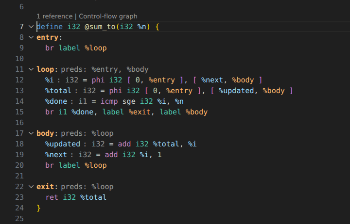

## Catch mistakes

**Built-in checks run as you type, with no LLVM installation:** undefined and duplicate
names, broken block structure, dominance, type mismatches, wrong call signatures,
and unused values (faded):

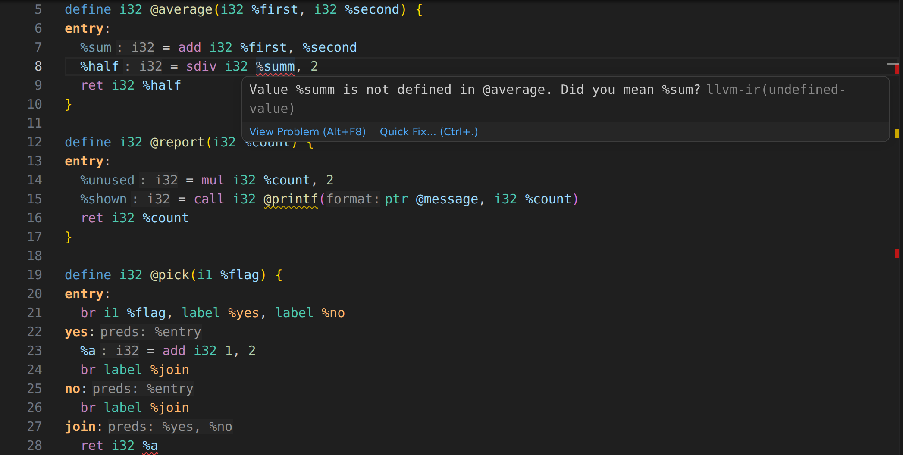

Quick fixes correct misspelled names, spell the function type that variadic calls
need, and add missing declarations:

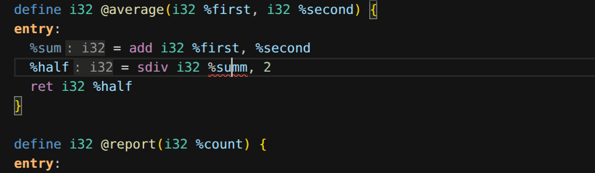

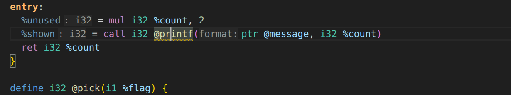

With LLVM installed, `llvm-as` also verifies each file as you edit (or on demand with
**LLVM IR: Verify Document** and **LLVM IR: Verify Workspace**). The `{ }` language
status in the status bar shows which LLVM version verifies, why verification is
unavailable if it is, and whether the workspace index is complete:

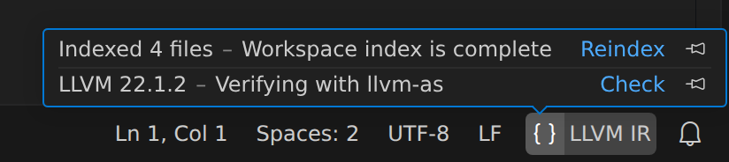

See [the full list of checks](#built-in-checks) under Reference.

## Navigate and refactor

- **Go to Definition**, **Find All References**, occurrence highlighting, and the
  document outline, across files: a `declare` leads to its definition in another file.
- **Rename** local values, blocks, globals and functions; cross-file renames are checked
  for linkage, collisions and stale files before anything changes:

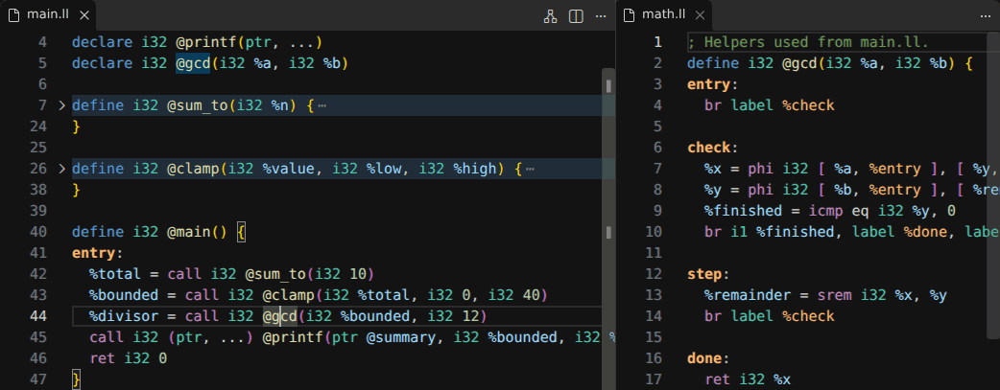

- A **reference count** above each function, global and named type; click it to peek
  the references.
- **Workspace symbol search** (Ctrl+T) over every indexed file.

## See control flow

**LLVM IR: Show Control-Flow Graph** (the `Control-flow graph` CodeLens, the editor
title button, or the context menu) opens a graph of the function beside the editor.
`T`/`F` mark conditional edges, dashed edges loop back, unreachable blocks are dimmed,
the highlight follows your cursor, and clicking a block jumps to it:

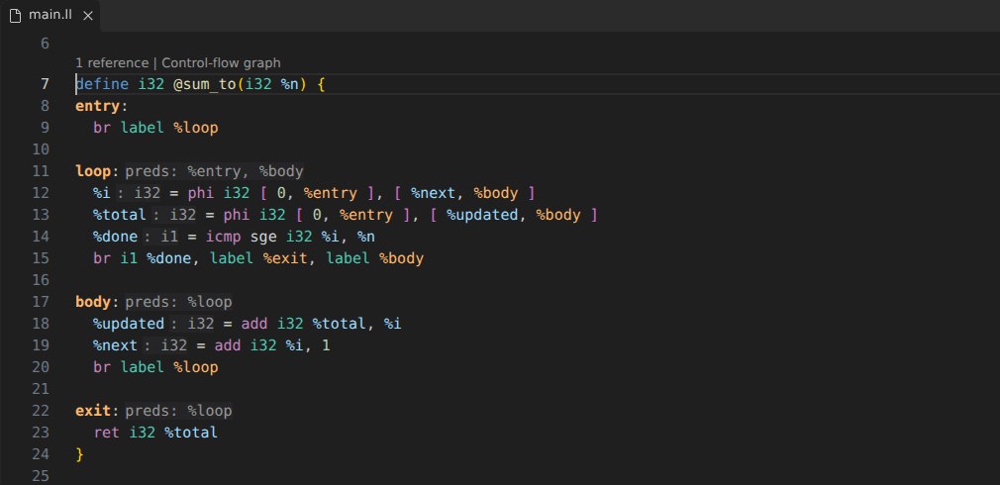

Block labels get their own color and bold definitions, so the structure of a function
stands out (see [Label color](#label-color)).

## Settings

| Setting | Default | Purpose |
| --- | --- | --- |
| `llvmIR.llvmAsPath` | `llvm-as` | Compiler executable matching your project's LLVM version |
| `llvmIR.diagnostics.enabled` | `true` | Automatically verify edited documents with `llvm-as` |
| `llvmIR.diagnostics.builtIn` | `true` | Built-in checks that need no LLVM installation |
| `llvmIR.diagnostics.scope` | `openFiles` | `workspace` also runs built-in checks on every indexed file |
| `llvmIR.diagnostics.delay` | `600` | Delay after edits, in milliseconds |
| `llvmIR.diagnostics.timeout` | `5000` | Compiler timeout, in milliseconds |
| `llvmIR.inlayHints.enabled` | `true` | Inferred types at SSA definitions and pointer pointees |
| `llvmIR.inlayHints.parameterNames` | `true` | Parameter names before call arguments |
| `llvmIR.inlayHints.predecessors` | `true` | `preds: …` after block labels |
| `llvmIR.labels.highlight` | `true` | Color labels with `llvmIR.labelForeground` and bold their definitions |
| `llvmIR.codeLens.controlFlowGraph` | `true` | `Control-flow graph` link above each function |
| `llvmIR.codeLens.references` | `true` | Reference counts above functions, globals and types |
| `llvmIR.semanticHighlighting.enabled` | `true` | Color resolved symbols by role |
| `llvmIR.libraryHelp.enabled` | `true` | Curated libc and intrinsic help |
| `llvmIR.workspace.enabled` | `true` | Index workspace IR files |
| `llvmIR.workspace.include` | `**/*.{ll,llvm}` | Included files |
| `llvmIR.workspace.exclude` | `**/{.git,node_modules,.vscode-test,build,dist,out}/**` | Excluded files |
| `llvmIR.workspace.maxFiles` | `500` | File limit per workspace folder |
| `llvmIR.workspace.maxFileBytes` | `2097152` | Byte limit per indexed file |
| `llvmIR.workspace.maxTotalBytes` | `33554432` | Source-byte limit per workspace folder |
| `llvmIR.workspace.projectRoots` | `[]` | Independent linkage projects within a workspace folder |

## Reference

<details>
<summary><strong>Cross-file support and library help</strong></summary>

The index discovers unopened `.ll` and `.llvm` files and follows edits, saves,
creates, deletions, and configuration changes. Unsaved buffers take precedence
over disk. Each workspace folder is a separate linkage scope; private/internal
symbols, local values, numbered globals, named types, labels, and metadata do not
gain cross-module identity just because their names match. Workspace symbol search
can still list separate module-local definitions.

For unrelated assignments or programs under one folder, merge this setting with
your existing configuration, choosing the actual independent directories:

```json
{
  "llvmIR.workspace.projectRoots": ["hw0", "hw1", "hw2"]
}
```

The longest matching directory wins; files outside those subdirectories remain
in the workspace folder's own scope. This is a configured scope, **not a discovered
linker/build graph**. A `declare` can navigate to a compatible implementation;
multiple implementations are returned as candidates, not arbitrarily selected.
Workspace completion adds a declaration only when it can be copied exactly: every
compatible definition must produce the same declaration, with no named (`%T`)
types and no alias. C-library help never generates declarations, because the
target ABI decides them. Parameter types and signature help continue to come from
the current module's actual IR.

Run **LLVM IR: Reindex Workspace** after changing the indexing scope or resolving
a limit/read failure. The Output channel explains incomplete indexing. Boolean
`files.exclude` and `search.exclude` patterns also apply; conditional sibling
exclusions are not implemented. Excluded/outside/untitled files retain isolated
editing, but cannot establish external rename completeness. Remote/virtual URIs
use VS Code's filesystem API; there is no filesystem-only language restriction.

External rename requires one strong definition, compatible signatures/targets,
a complete configured index, no collisions, and fresh source snapshots. It refuses
weak/ODR/replaceable definitions, external-only APIs, reserved `llvm.*` names,
unsupported named-type/attribute-group ABI comparisons, aliases/ifunc identities,
COMDAT, symbol-bearing assembly/linker options, and matching debug linkage strings.
Different or partially specified target triples/data layouts are conservative
compatibility failures. This can reject a valid rename rather than silently omit
uncertain references. Review the edit preview: excluded files, external consumers,
build scripts and binary libraries are outside the index, and concurrent external
writes cannot be locked by this extension.

Hover a compatible `declare @printf` or its calls for return behavior, parameters,
conversion/length/flag tables, C vararg promotions, and target-ABI cautions.
Library help is qualified documentation, not proof that the linker selects libc;
a known workspace implementation suppresses the annotation. Intrinsic overloads
are matched conservatively, including supported typed/opaque pointer and vector
spellings, with version notes. No network requests occur at runtime.

No automatic declarations, libc source download/navigation, format-string
validation, or automatic linking are provided. The catalog is intentionally finite.
See the bundled `research-existing-lsps.md` and `research-library.md` reports
for primary sources and niche cases.

</details>

<details>
<summary><strong>Built-in checks</strong></summary>

<a id="built-in-checks"></a>

The extension checks IR as you type, without `llvm-as`. Every error below is one
`llvm-as` rejects; the test suite checks that against LLVM when it is installed, and
checks that clang output (with `-O0`–`-O3`, `-g` debug info, C++ exceptions, computed
`goto`, and atomics) produces no errors or warnings.

| Severity | Code | Reports |
| --- | --- | --- |
| Error | `undefined-value`, `undefined-label`, `undefined-type`, `undefined-metadata` | Names with no definition, with a “Did you mean …?” quick fix |
| Error | `duplicate-definition` | Redefinitions of a global, type, metadata node, or local name (values, parameters, and blocks share one namespace per function) |
| Error | `numbering` | Numbered values that do not increase, counting unnamed parameters, blocks, and results |
| Error | `missing-terminator`, `empty-body`, `missing-body`, `unclosed-body` | Blocks without `ret`/`br`/…, and malformed function bodies |
| Error | `entry-branch`, `not-a-label`, `phi-position`, `phi-predecessors` | Branches to the entry block or to values, and `phi` placement or incoming blocks that do not match the predecessors |
| Error | `dominance` | Uses of a value on a path where it is not yet defined, and non-`phi` self references |
| Error | `type-mismatch`, `return-type`, `void-result`, `memory-operands` | Operands whose known type differs from the one written, wrong `ret`, naming a `void` result, and `store`/`load` operands in the wrong order |
| Error | `unknown-instruction` | Misspelled opcodes, with a quick fix |
| Warning | `call-signature`, `variadic-call` | Calls whose arguments or result differ from the callee's declaration, and variadic calls without the function type that LangRef requires (quick fix inserts it) |
| Warning | `division-by-zero`, `unreachable-code`, `undefined-attributes` | Constant zero divisors, instructions after a terminator, and attribute groups LLVM would silently drop |
| Hint (faded) | `unused-value`, `unused-declaration`, `unused-private`, `unreachable-block` | Values, declarations, and private symbols that are never used, and blocks no path reaches |

An undefined `@name` that another workspace file defines gets an **Add declaration**
quick fix, using the same agreed declaration as completion.

The checks stay silent when the parse cannot establish a fact: unknown types,
implicitly numbered branch targets, or unparsed instructions. `llvm-as` remains the
authority, and when it reports an error on a line, the built-in error on that line is
hidden so a mistake appears once. Set `llvmIR.diagnostics.scope` to `workspace` to
check every indexed file; **LLVM IR: Verify Workspace** runs `llvm-as` on all of them
and summarizes how many fail.

</details>

<details>
<summary><strong>Verification with llvm-as</strong></summary>

Run **LLVM IR: Verify Document** for immediate verification. Execution/availability
issues appear in the **LLVM IR Language Tools** Output channel. Verification requires
a trusted workspace. Source is passed through stdin with no shell, execution of IR,
or output files in your project. Missing LLVM does not disable other editing features.

</details>

<details>
<summary><strong>Colors and label color</strong></summary>

Semantic highlighting defaults on for LLVM IR.

### Label color

VS Code's themes color labels (`entity.name.label`) like plain text: `#C8C8C8` in
Dark Modern and black in Light Modern. The same convention applies to C/C++, C#,
JavaScript, and Go labels, where `goto` targets are rare. In IR, every block starts with a label and
every `br` and `phi` names one, so the extension gives them a theme color of their own,
`llvmIR.labelForeground`, and bolds definitions. Its defaults were chosen against all 19 bundled
themes. Each has at least 6.8:1 contrast and stays clearly distinct from the function, type,
variable, instruction, number, and string colors:

| Theme kind | Default |
| --- | --- |
| Dark | `#FFB86C` |
| Light | `#953800` |
| High contrast | `#FFB86C` |
| High contrast light | `#8A4600` |

Change it like any theme color, or set `llvmIR.labels.highlight` to `false` to fall back to
the theme's own label color and `label:llvm-ir` semantic rules:

```json
{
  "workbench.colorCustomizations": { "llvmIR.labelForeground": "#C586C0" }
}
```

Explicitly disabling `editor.semanticHighlighting.enabled` or the extension's
semantic setting leaves grammar-only highlighting, which cannot resolve every
label reference. Folding requires `editor.foldingStrategy` to be `auto` (the default).

Color roles follow TextMate/VS Code conventions; there is no universal fixed
palette across themes. Built-in types use `support.type`, word-form instruction
operators use `keyword.other.operator`, control flow uses `keyword.control`,
and labels use `entity.name.label` (not the HTML-tag scope), recolored by
`llvmIR.labelForeground` as above. In Dark Modern this separates instruction operators
(purple), types (teal), functions (yellow), variables (light blue), and numbers
(green). Light Modern uses its corresponding accessible light-background palette.
No theme is switched and no global user color overrides are written.

</details>

<details>
<summary><strong>Scope and limitations</strong></summary>

The analyzer tolerates incomplete source but is not a complete LLVM parser. It
infers common instruction types and uses `unknown` when a type cannot be established.
Opaque `ptr` values do not imply a known pointee type.
An access hint records how a pointer is used; it does not prove a source-language
class or a permanent pointee type. Conflicting uses or an escaping stack slot
prevent the corresponding hint. Value and receiver hints come
from direct stores and constant tables in the current file only; memory written by
`memcpy`, through an escaped pointer, or by another module is not observed. Any
non-global value stored to the same field withholds the hint.
Operand completion computes dominance from `br`/`switch`/`invoke` labels in the
current function. It filters by the inferred type, so values of `unknown` type are
still offered, ranked below exact matches. It suggests values, not constant
expressions.

Navigation/completion use the configured workspace index, not a linker or a complete
LLVM language server. Signature help requires a local function declaration/definition. Numbered
identifiers cannot be renamed because their numbering is structural. Unusual or
new target-specific constructs may have limited editor analysis even when LLVM
accepts them. Compiler diagnostics reflect the configured LLVM version.

Formatting changes indentation and trailing whitespace, not instruction layout or
semantics. There is no debugger, automatic refactoring, or diagnostic quick-fix
engine. This is a local package, not a published Marketplace release.

</details>

## Develop and test

Source/tests require Node.js 18 or later; packaging tools require Node.js 20 or later.
Open the repository in VS Code and press **F5** for an Extension Development Host.

To build and install from source:

```sh
npm ci --ignore-scripts
npm test
npm run package
code --install-extension ./llvm-ir-language-tools-*.vsix
```

```sh
npm test                  # unit tests, no VS Code needed
npm run test:integration  # the extension inside a real VS Code
npm run package           # build the .vsix
```

The integration runner normally downloads a test VS Code. To use an existing
Linux installation:

```sh
VSCODE_EXECUTABLE_PATH=/usr/share/code/code npm run test:integration
```

Tests use temporary user/extension directories and do not install into your daily
profile. Linux needs a display (or `xvfb-run`); with none at all, set
`VSCODE_TEST_HEADLESS=1` to render off screen. Unit tests need no VS Code. Real
LLVM tests skip when `llvm-as` is unavailable. A few tests also run against course
homework that is not part of this repository; they skip unless `LLVM_IR_COURSE_DIR`
points at a directory containing `hw0/` and `hw2/`. Set it in the environment or copy
`.env.example` to `.env` (gitignored).
The host tests also tokenize against the actual bundled Dark Modern and Light
Modern themes, asserting six distinct role colors and matching label references.
Multi-root tests use copied temporary fixtures to check unopened-file navigation,
cross-file references/rename, collisions, exclusions, library hovers and dirty buffers.
`VSCODE_VERSION=1.85.0 npm run test:integration` tests a specific release; CI runs
1.85.0 (the oldest supported) and the latest.

To release, bump `version` in `package.json`, add its `## X.Y.Z` section to
`CHANGELOG.md`, and push a matching `vX.Y.Z` tag. The Release workflow checks that
the tag and version agree, runs the unit tests, and publishes a GitHub Release with
the VSIX attached and that changelog section as notes. To publish an existing tag,
run the workflow from the Actions tab with the tag name.

To measure what one keystroke costs in each editor feature, run the benchmark on
any IR files, for example clang output (`clang -S -emit-llvm`):

```sh
npm run bench -- big.ll other.ll --runs 5
```

It prints the median milliseconds per feature. On a 1.7 MB `-O2` C++ module a
keystroke costs about 0.5 s in total, and about 1 s at 3.7 MB (`-O0`).

### README screenshots and GIFs

Every image in this README is captured from a real VS Code by scripts in
`scripts/capture/scenarios/`, using the demo project in `docs/demo/`:

```sh
npm run capture                # all scenarios, into docs/media/
npm run capture -- hovers      # one scenario
```

A scenario drives the editor (open a file, move the cursor, type, hover) and
records stills or GIFs through the Chrome DevTools Protocol; `scripts/capture/host.js`
documents its API. VS Code renders off screen, so no display is needed. Each GIF
also writes its first, middle and last frames to `docs/media/.frames/` for review.
After changing a feature, rerun its scenario and check the result.

## Attribution and references

The original grammar/editor configuration are from Leo Pagano's MIT-licensed LLVM
IR Highlighter. This fork includes the MIT license in `LICENSE.md` and adds
language analysis and editor services.

- [LLVM Language Reference](https://llvm.org/docs/LangRef.html)
- [VS Code programmatic language features](https://code.visualstudio.com/api/language-extensions/programmatic-language-features)
- [VS Code syntax highlighting guide](https://code.visualstudio.com/api/language-extensions/syntax-highlight-guide)
